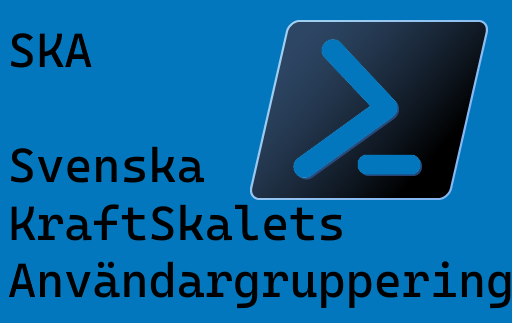

# KraftSkal på svenska

[Angående onödig anglifiering.](http://www.språkförsvaret.se/sf/index.php?id=189)

## Förord

Det pågår ett förfall bland svenska programutvecklare, där dessa i allt större skala slutat använda proper svensk vokabulär till förmån för anglifieringar och allmänt hemskt ordbruk.

Detta förfall måste stoppas.

Tyvärr har detta pågått under väldigt lång tid, och många programutvecklares språk är förkastligt, men vi vägrar tro att allt hopp för det svenska språket är ute.

Ett av de programspråk som på senare år lockat nya programutvecklare att skriva kod är Microsofts nya skal "PowerShell". 

Vi tror att de människor som idag börjat använda detta skal är de människor som i framtiden kommer leda återkomsten av ett kvalitativt svenskt språkbruk.

Det är för dessa människor vi skapat detta dokument.

---

## Inledning

Redan i början vill vi påtala vikten av att frångå anglifieringen av den svenska programutvecklarens vokabulär.

Vi kommer därför hädanefter att benämna skalet med den korrekta svenska termen KraftSkal.

---

## Standardiserade utryck

Nedan följer en tabell med korrekt svensk vokabulär att användas när du skriver dina befallningar i ditt KraftSkal.

| Grundkommando | Anglifierat uttryck | Tecken i KraftSkalet |
|---|---|---|
| Daler | Dollar | $ |
| Golvsträck | Underscore | _ |
| Mindre än-tecken*** | Less than | < |
| Större än-tecken*** | Greater than | > |
| Rak parentes | Bracket | [ ] |
| Klammerparentes* | Curly bracket | { } |
| Nummertecken | Hash | # |
| Lodstreck | Pipe | \| |
| Hårt blanksteg | Non breaking white space | \&nbsp; |
| Alfakrull | At | @ |
| Omvänt snedstreck | Backslash | \ |
| snedstreck | Slash | / |
| Bindestreck-minus | minus / dash | - |
| Raka citationstecken** | quote | ' / " |

\* I fallet då en variabel skall typbestämmas till en lista genom befallningen `@{}` skall uttrycket mängdklammer användas: Alfakrull Mängdklammer.

\** Raka citationstecken finns både i enkel (') och dubbel (") version. Får ej blandas ihop med Typografiska citationstecken (’, ”, ‘, “).

\*** Vissa teckensnitt som används av KraftSkalet har även stöd för specialtecknet 'dubbelt vinkelcitationstecken' som består av två på varandra följande Mindre än eller Större än tecken.

---

## Allmän vokabulär och terminologi.

Vidare utryck som bör undvikas, samt deras korrekta svenska varianter:

- Typa - bör ersättas med typbestämma.
- Stjärna (*) bör ej användas. Symbolen är en asterisk, och bör så benämnas.
  - I somliga meningsbyggnader används ordet "Wildcard", vilket är en anglifiering. Den korrekta svenska benämningen i detta fall är "Jokertecken".

- Kommando är tillåtet, men kan även ersättas med befallning:

```Text
- Ge ditt KraftSkal befallningen `Hämta-BarnObjekt`.
```

- Regex är en sammanslagning av orden "REGular EXpression". Vi har ypperligt bra svenska ord för att ersätta dessa, "REGuljära UTtryck", sålunda benämns det hädanefter Regut.

---

## Vidareutveckling och fortgående utveckling av det svenska KraftSkalet.

Då KraftSkalet kontinuerligt utvecklas och förbättras kommer det fortsätta komma nya befallningar och uttryck. Vi ber er därför vara vaksamma på eventuella anglifieringar som får fäste och hjälpa till att hålla det svenska KraftSkalets terminologi korrekt genom att bidra till detta dokument genom att göra en så kallad drag förfrågan från ditt eget GitNav med förbättringar.

---

## Historik

| Version | Förbättringar |
|---------|---------------|
| 1.0     | Inledande utgåva av detta dokument |

---

